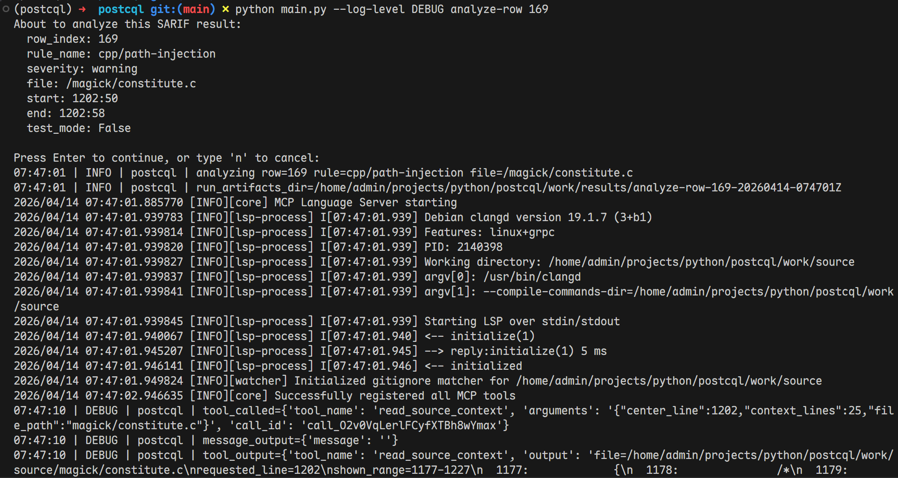
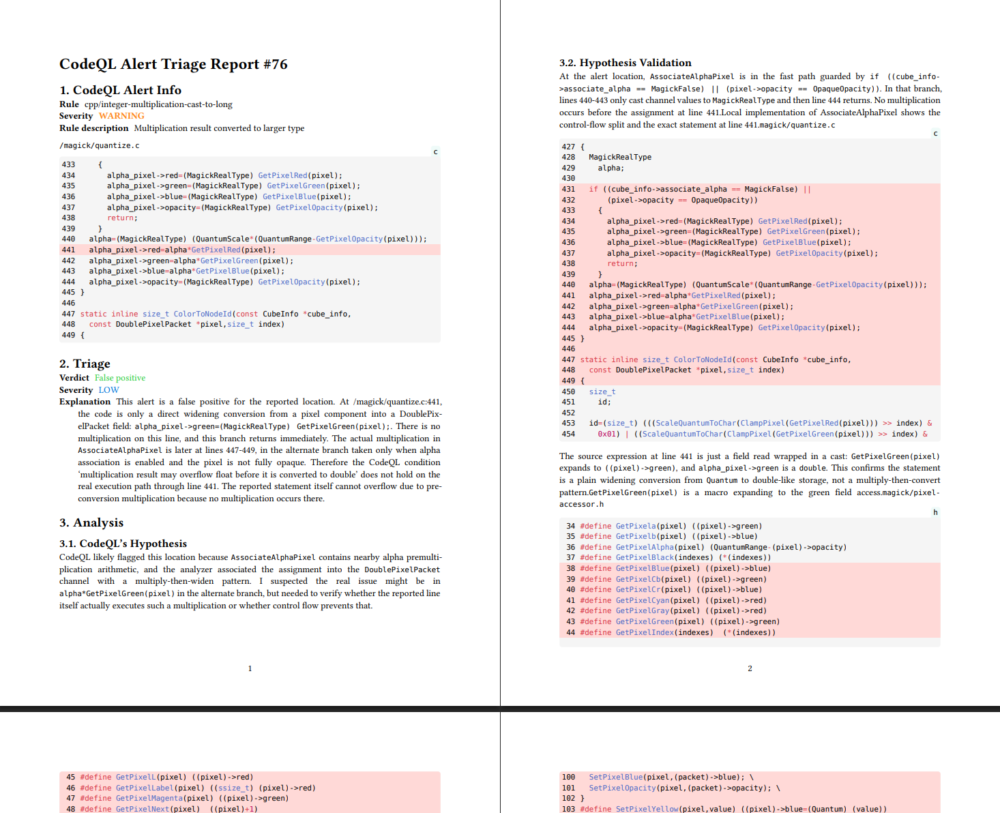

# PostCQL

PostCQL 是一个面向 CodeQL 告警分诊的实验性 CLI 工具. 

## 架构

见下图. 详见报告. 


## 运行展示





## 用法

### 安装必要的软件

1. 安装 [uv](https://docs.astral.sh/uv/getting-started/installation/).
2. 安装 [codeql-cli](https://github.com/github/codeql-cli-binaries).
3. 安装 [`codeql/cpp-queries`](https://github.com/orgs/codeql/packages/container/package/cpp-queries).
4. 安装 [typst](https://github.com/typst/typst?tab=readme-ov-file#installation).
5. 安装 [clangd](https://clangd.llvm.org/installation#installing-clangd).
6. 安装 [mcp-language-server](https://github.com/ParaN3xus/mcp-language-server/releases/tag/v0.0.3).

### 获取目标项目源码

下载源码并解压到工作目录:
```sh
mkdir -p work/source && wget https://imagemagick.org/archive/releases/ImageMagick-6.9.2-10.tar.xz && tar -xJf ImageMagick-6.9.2-10.tar.xz -C work/source --strip-components=1
```

请确保环境中有构建该项目所必须的工具链和共享库等.

### 使用 CodeQL 分析目标项目

配置目标项目

```sh
cd work/source
./configure
cd ../..
```

构建数据库

```sh
codeql database create work/codeql-db \
    --language=cpp \
    --source-root=work/source \
    --command="make -j$(nproc)"
```

执行分析

```sh
mkdir work/codeql-results
codeql database analyze work/codeql-db \
  codeql/cpp-queries:codeql-suites/cpp-security-extended.qls \
  --format=sarifv2.1.0 \
  --output=work/codeql-results/all.sarif \
  --threads=0
```

### 使用 PostCQL 研判分析结果

安装项目依赖

```sh
uv sync
```

进入虚拟环境

```sh
source .venv/bin/activate
```

构建 `compile_commands.json`

```sh
cd work/source && make clean && compiledb -f -o compile_commands.json make -j$(nproc) && cd ../..
```

修改配置
```sh
cp config.toml.example config.toml
```

然后手动修改 `config.toml` 中的相关字段. 

执行研判任务

```sh
mkdir work/results

# 部分告警
python main.py analyze-row 行号

# 全部告警
python main.py analyze-all
```

结果将出现在 `work/results` 目录中.
